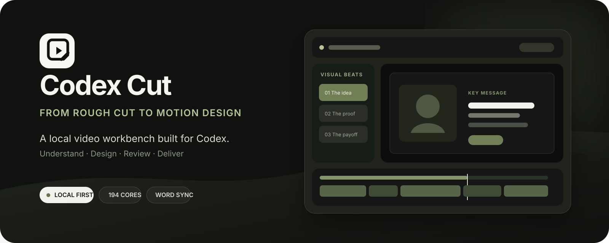
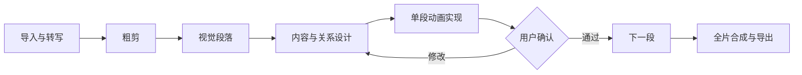
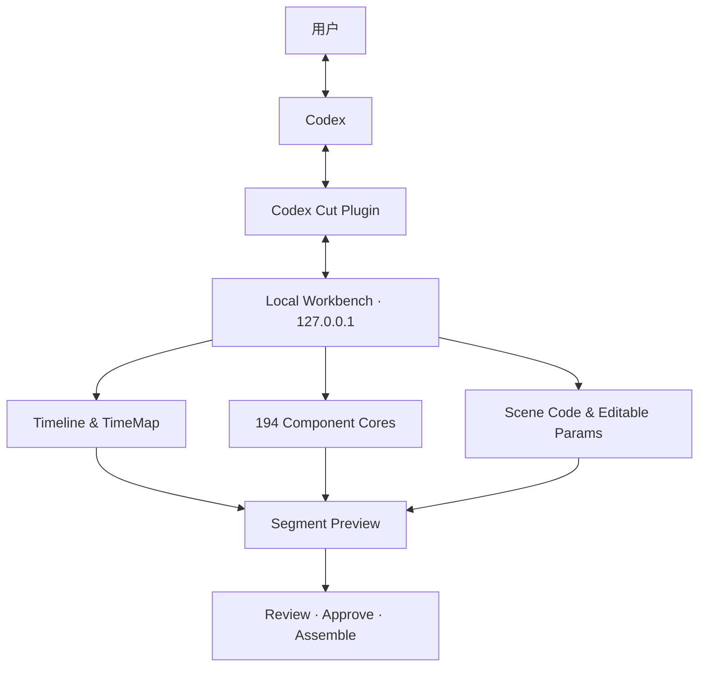

<p align="center">
  
</p>

<p align="center">
  <strong>让一个 Agent 从口播粗剪走到动画包装，再由人把控最终审美。</strong>
</p>

<p align="center">
  <a href="#真实运行演示">运行演示</a> ·
  <a href="#核心能力">核心能力</a> ·
  <a href="#六步制作方法">制作流程</a> ·
  <a href="#快速开始">快速开始</a> ·
  <a href="#codex-插件">Codex 插件</a> ·
  <a href="#工程边界">工程边界</a>
</p>

---

## 真实运行演示

<p align="center">
  
</p>

<p align="center">
  <strong>这是仓库内实际组件运行时的渲染结果，不是概念图。</strong><br />
  <sub>内容理解 → 关系编排 → 单段制作与确认 → 可编辑动画核心</sub>
</p>

<p align="center">
  <a href="assets/readme/runtime-demo.mp4">播放 1080p MP4</a> ·
  <a href="workbench-local/readme-demo-entry.tsx">查看演示源码</a> ·
  <code>npm run render:readme-demo</code>
</p>

| 输入 | Codex 负责 | 工作台负责 | 用户得到 |
|---|---|---|---|
| 原视频、逐字稿、素材与修改意见 | 粗剪判断、重点提取、画面设计、动画实现 | 时间映射、素材绑定、预览、参数、版本与渲染 | 可播放、可修改、可逐段确认的成片工程 |

## Codex Cut 是什么

Codex Cut 是一个 **Codex 驱动、本地运行的视频剪辑与动画包装工作台**。Codex 负责理解内容、提取重点、编排视觉层级和实现动画；工作台负责稳定的素材、时间、版本、预览、手动调节、逐段确认与最终合成。

它面向口播、访谈、教程和知识类视频。创作过程围绕真实文稿与口播节奏展开，让动画在说到对应内容时依次出现。

> 当前基线：`v0.1.0` · 本地优先 · Apple Silicon macOS 已验证 · 项目和媒体默认不进入 Git

## 核心能力

| | 能力 | 实际行为 |
|---|---|---|
| **01** | 文稿驱动粗剪 | 导入素材、转写、按词编辑口播，剪辑结果保持画面与声音同步 |
| **02** | 六步视觉设计 | 从视觉段落、信息对象和关系出发，再决定布局、包装与动画实现 |
| **03** | 逐词动画同步 | 动画绑定具体词句；剪辑变化后重新计算成片时间，失效引用明确提示 |
| **04** | 逐段制作与确认 | 每个视觉段落单独预览、渲染带原声样片、反馈和确认，再合成全片 |
| **05** | 可编辑场景 | 文案、字体、颜色、位置、素材和动画参数可调；结构性改动由 Codex 修改代码 |
| **06** | 194 个动画核心 | 组件库支持搜索、真实预览、参数控制、素材槽位和收藏，缺少的场景可直接编写 |
| **07** | 本地版本保护 | revision、哈希、原子保存、撤销、过期任务保护和已确认版本共同守住用户修改 |
| **08** | 素材提需 | 缺失素材挂在对应段落，保留理想设计，同时允许继续处理其他段落 |

## 六步制作方法

| 1 · 粗剪 | 2 · 视觉段落 | 3 · 视觉对象 |
|---|---|---|
| 删除废话、口误与无效停顿，确认内容地基 | 依据论述结构划分画面任务和节奏 | 为每段确定唯一主信息与辅助证据 |

| 4 · 信息布局 | 5 · 包装设计 | 6 · 动画实现 |
|---|---|---|
| 用构图表达并列、对比、流程、因果等关系 | 决定哪些对象需要被强调以及为什么 | 选择组件、改造组件或编写新场景，并绑定口播词句 |



## 工作方式



- **Codex** 做语义理解、创意判断、视觉编排和复杂动画开发。
- **工作台** 掌管稳定 ID、媒体真实性、时间映射、几何参数、revision、撤销和持久化。
- **用户** 查看真实画面和带原声样片，调节参数并决定是否确认。

## 快速开始

### 环境

- Node.js `>= 22.13.0`
- FFmpeg 与 ffprobe
- Whisper（需要本地转写时）
- 当前完整流程在 Apple Silicon macOS 上完成验证

### 启动

```bash
git clone https://github.com/zhangyuyao-zx/codex-cut.git
cd codex-cut
npm ci
npm start
```

打开 [http://127.0.0.1:4340](http://127.0.0.1:4340)。在 macOS 上也可以双击 **打开工作台.command**。

```bash
npm run status   # 查看服务状态
npm run stop     # 保存后停止服务
npm run dev      # 开发模式
```

正式渲染还需要匹配当前平台的浏览器与 Remotion 合成器。可使用以下环境变量指向本机运行时：

| 变量 | 用途 |
|---|---|
| `WORKBENCH_PROJECT_DIR` | 独立工程目录 |
| `WORKBENCH_PORT` | 服务端口，默认 `4340` |
| `WORKBENCH_FFMPEG` / `WORKBENCH_FFPROBE` | 视频工具路径 |
| `WORKBENCH_WHISPER` / `WORKBENCH_WHISPER_MODEL` | 转写程序和模型路径 |
| `WORKBENCH_CHROME` | Remotion 使用的浏览器 |
| `WORKBENCH_COMPOSITOR` | Remotion 合成器目录 |

## Codex 插件

仓库内置插件包位于 [`workbench-local/plugin-package/codex-cut`](workbench-local/plugin-package/codex-cut)。插件提供一个视频制作 Skill 和 7 个本地 MCP 工具，用来打开工作台、读取工程、提交修改、管理单段渲染与确认。

在插件配置中指定本仓库的实际路径后，可以直接对 Codex 说：

```text
打开 Codex Cut，读取当前项目和待确认段落。
用六步方法制作这条视频，逐段给我确认。
只修改我指出的段落，保留已经确认的版本。
```

插件只连接本机 `127.0.0.1`，不会携带视频、API 密钥或内置模型。完整说明见[插件 README](workbench-local/plugin-package/codex-cut/README.md)。

## 项目结构

```text
codex-cut/
├── workbench-local/       # UI、本地服务、CLI、场景与插件包
├── modules/
│   ├── components/        # 194 个组件核心与运行时
│   ├── component-lab/     # 组件适配与视觉核心
│   ├── contracts/         # 工程、创意计划和场景协议
│   ├── server/            # 转写能力
│   └── shared/            # TimeMap、素材与共享规则
├── public/                # 公共视觉素材与保存动画
├── projects/              # 本地工程和媒体，不进入 Git
├── runtime/               # 本机渲染运行时，不进入 Git
├── docs/                  # 组件来源与实现记录
└── assets/branding/       # 插件品牌资产
```

## 工程边界

- 预览与正式渲染共享场景代码、参数和时间计划；最终交付以带原声实际视频为准。
- 结构检查、自动化测试、实际渲染、视听 QA 和用户审美确认是不同的验收层级。
- `projects/`、`runtime/`、`node_modules/` 与本机插件配置已被 `.gitignore` 排除。
- Git 保存源码与锁文件；工程媒体和渲染运行时需要单独备份。
- 当前发布基线经过本机流程验证，跨平台渲染环境仍需按目标机器配置和复验。

## 开发与验证

```bash
npm run typecheck
npm test
```

组件来源及授权说明见 [`docs/COMPONENT_LICENSES.md`](docs/COMPONENT_LICENSES.md)。独立版提取与恢复边界见 [`MIGRATION.md`](MIGRATION.md)。

## 状态

- **当前版本**：`0.1.0`
- **源码状态**：独立工作台，不依赖已归档的旧 App 工程
- **产品状态**：可继续实际项目制作与局部维护
- **授权状态**：尚未声明开源许可证，默认保留全部权利
